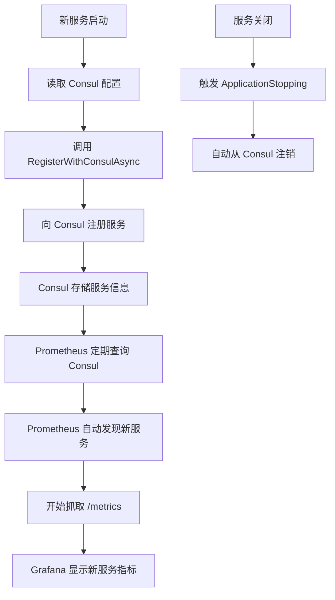

# 🚀 自动化服务注册指南

## 📌 概述

通过服务自注册机制，新服务启动时会自动：
1. ✅ 注册到 Consul（无需手动配置文件）
2. ✅ 被 Prometheus 自动发现并抓取指标
3. ✅ 服务下线时自动注销

**无需手动配置 Consul JSON 或 Prometheus 配置文件！**

---

## 🎯 创建新服务的步骤

### 1️⃣ 在 Program.cs 中使用自动注册

```csharp
using Shared.Extensions;
using Prometheus;

var builder = WebApplication.CreateBuilder(args);

// ... 添加你的服务配置 ...

builder.Services.AddControllers();
builder.Services.AddOpenApi();

var app = builder.Build();

// 配置中间件
app.UseRouting();
app.UseHttpMetrics();  // Prometheus 指标收集

// 添加健康检查端点（必需）
app.MapGet("/health", () => Results.Ok(new 
{ 
    status = "healthy", 
    service = "your-service-name", 
    timestamp = DateTime.UtcNow 
}));

// 添加 Metrics 端点（必需）
app.MapMetrics();

// ⭐ 自动注册到 Consul
await app.RegisterWithConsulAsync();

app.Run();
```

### 2️⃣ 在 appsettings.Development.json 中配置

```json
{
  "Consul": {
    "Address": "http://go-nomads-consul:8500",
    "ServiceName": "your-service-name",
    "ServiceAddress": "go-nomads-your-service",
    "ServicePort": 8080,
    "HealthCheckPath": "/health",
    "HealthCheckInterval": "10s",
    "ServiceVersion": "1.0.0"
  }
}
```

**配置说明：**
- `ServiceName`: 服务在 Consul 中的名称（使用 kebab-case）
- `ServiceAddress`: Docker 容器主机名（格式：`go-nomads-{service-name}`）
- `ServicePort`: 容器内部端口（通常是 8080）
- `HealthCheckPath`: 健康检查端点路径
- `ServiceVersion`: 服务版本号

### 3️⃣ 在 Dockerfile 中确保正确的端口暴露

```dockerfile
FROM mcr.microsoft.com/dotnet/aspnet:9.0
WORKDIR /app
EXPOSE 8080
COPY --from=build /app/out .
ENTRYPOINT ["dotnet", "YourService.dll"]
```

### 4️⃣ 构建并启动服务

```bash
# 构建镜像
cd /path/to/your/service
docker build -t go-nomads-your-service:latest .

# 启动服务（会自动注册到 Consul）
docker run -d \
  --name go-nomads-your-service \
  --network go-nomads-network \
  -e ASPNETCORE_ENVIRONMENT=Development \
  -p 5004:8080 \
  go-nomads-your-service:latest

# 验证注册
curl http://localhost:8500/v1/catalog/service/your-service-name
```

---

## 🔄 工作流程



---

## ✅ 已支持自动注册的服务示例

### UserService 配置示例

**Program.cs**
```csharp
using Shared.Extensions;
// ... 其他 using ...

var app = builder.Build();

// ... 配置管道 ...

app.MapGet("/health", () => Results.Ok(new { status = "healthy", service = "UserService" }));
app.MapMetrics();

await app.RegisterWithConsulAsync();
app.Run();
```

**appsettings.Development.json**
```json
{
  "Consul": {
    "Address": "http://go-nomads-consul:8500",
    "ServiceName": "user-service",
    "ServiceAddress": "go-nomads-user-service",
    "ServicePort": 8080,
    "HealthCheckPath": "/health",
    "HealthCheckInterval": "10s",
    "ServiceVersion": "1.0.0"
  }
}
```

---

## 🔍 验证服务注册

### 1. 检查 Consul 注册状态
```bash
# 查看所有服务
curl http://localhost:8500/v1/catalog/services

# 查看特定服务详情
curl http://localhost:8500/v1/catalog/service/your-service-name

# 查看健康检查状态
curl http://localhost:8500/v1/health/service/your-service-name
```

### 2. 检查 Prometheus 目标
```bash
# 查看所有 Prometheus targets
curl http://localhost:9090/api/v1/targets | jq '.data.activeTargets[] | {service: .labels.service, health: .health}'
```

### 3. 验证指标抓取
```bash
# 测试 Prometheus 查询
curl 'http://localhost:9090/api/v1/query?query=up{service="your-service-name"}'
```

### 4. 查看 Grafana Dashboard
访问: http://localhost:3000/d/go-nomads-services

---

## 🚫 不再需要的操作

### ❌ 不再需要手动创建 Consul JSON
```bash
# 以前需要：
echo '{"Name": "your-service", ...}' > consul/services/your-service.json
curl -X PUT --data @your-service.json http://localhost:8500/v1/agent/service/register
```

### ❌ 不再需要修改 Prometheus 配置
```yaml
# 以前需要在 prometheus.yml 中添加：
# - job_name: 'services'
#   static_configs:
#     - targets: ['your-service:8080']
```

### ❌ 不再需要重启 Prometheus
```bash
# 以前需要：
docker restart go-nomads-prometheus
```

---

## 🛠️ 故障排查

### 问题 1: 服务未注册到 Consul

**检查日志：**
```bash
docker logs go-nomads-your-service | grep Consul
```

**可能原因：**
- Consul 地址配置错误
- 服务无法连接到 Consul（网络问题）
- `appsettings.Development.json` 中缺少 Consul 配置

**解决方法：**
```bash
# 验证 Consul 可访问性
docker exec go-nomads-your-service ping go-nomads-consul

# 检查配置是否加载
docker exec go-nomads-your-service env | grep Consul
```

### 问题 2: Prometheus 未抓取指标

**检查 Prometheus targets：**
```bash
curl http://localhost:9090/api/v1/targets | jq '.data.activeTargets[] | select(.labels.service=="your-service-name")'
```

**可能原因：**
- 服务未暴露 `/metrics` 端点
- 服务元数据缺少 `metrics_path`
- Prometheus 重新标签配置错误

**解决方法：**
```bash
# 验证 metrics 端点可访问
curl http://your-service-address:8080/metrics

# 查看 Consul 元数据
curl http://localhost:8500/v1/catalog/service/your-service-name | jq '.[0].ServiceMeta'
```

### 问题 3: 健康检查失败

**检查健康状态：**
```bash
curl http://localhost:8500/v1/health/service/your-service-name?passing
```

**可能原因：**
- `/health` 端点未实现
- 健康检查 URL 配置错误
- 服务启动慢，健康检查超时

**解决方法：**
```bash
# 手动测试健康检查
curl http://your-service-address:8080/health

# 增加健康检查超时时间
# 在 appsettings.json 中:
# "HealthCheckTimeout": "10s"
```

---

## 📚 参考资料

- **Consul HTTP API**: https://developer.hashicorp.com/consul/api-docs
- **Prometheus Consul SD**: https://prometheus.io/docs/prometheus/latest/configuration/configuration/#consul_sd_config
- **ASP.NET Core Health Checks**: https://learn.microsoft.com/aspnet/core/host-and-deploy/health-checks

---

## 🎉 总结

使用自动服务注册后：
- ✅ **无需手动配置文件** - 服务自己注册
- ✅ **无需重启基础设施** - Prometheus 自动发现
- ✅ **自动清理** - 服务下线时自动注销
- ✅ **零配置扩展** - 新服务只需添加两行代码

**创建新服务只需 3 步：**
1. 添加 `await app.RegisterWithConsulAsync();`
2. 配置 `appsettings.Development.json`
3. 启动容器 ✨
